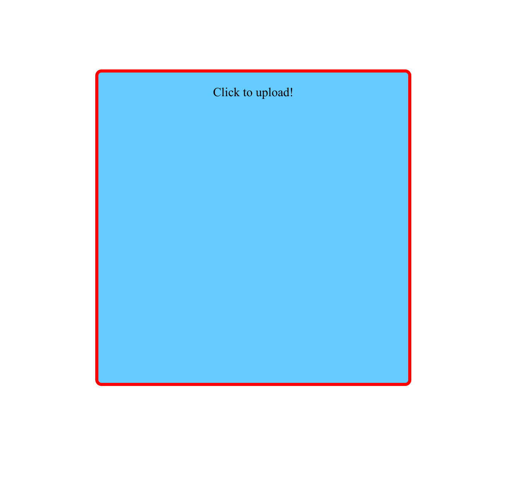
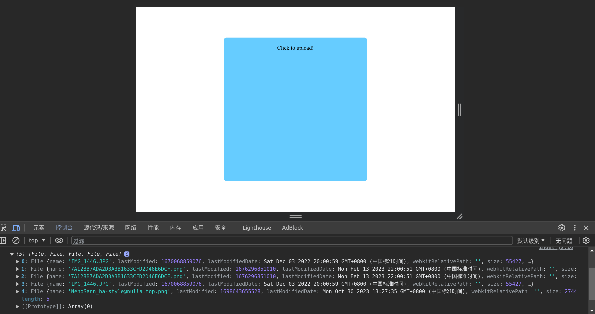
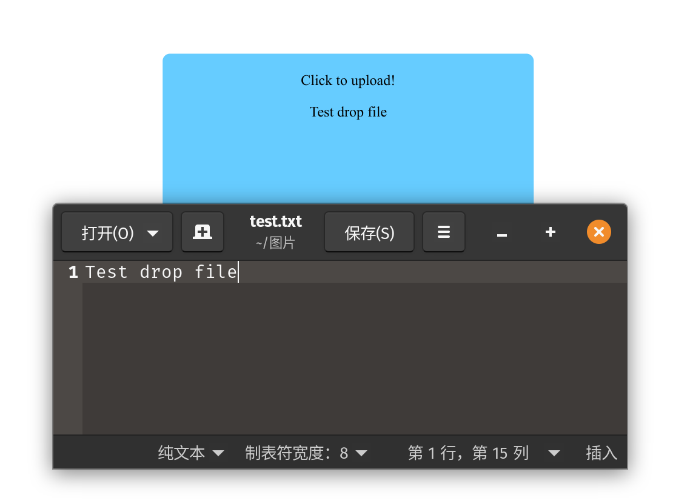

# HTML文件拖拽上传

## 实现原理
使用HTML的HTML拖放接口([Drag and Drop](https://developer.mozilla.org/zh-CN/docs/Web/API/HTML_Drag_and_Drop_API))来获得拖拽文件的数据，然后通过FileReader或者FileList来获得文件流数据。

## 基础知识(事件与对象)
### 拖拽事件
*如果想在html中监听下列事件，可以使用on+对应事件名称，如 ondrop, ondrag*
* [drop](https://developer.mozilla.org/zh-CN/docs/Web/API/HTMLElement/drop_event) 作用于元素，当一个元素或者文字文件被拖拽进入一个有效的位置**并且释放**的时候会触发 drop事件
* [dragenter](https://developer.mozilla.org/zh-CN/docs/Web/API/HTMLElement/dragenter_event) 作用于元素，当元素或者文件进入有效位置的时候触发 dragenter事件
* [dragleave](https://developer.mozilla.org/zh-CN/docs/Web/API/HTMLElement/dragleave_event) 作用于元素，当元素或者文件离开有效位置时触发
* [dragover](https://developer.mozilla.org/zh-CN/docs/Web/API/HTMLElement/dragover_event) 作用于元素，当元素或者文件位于有效位置时触发，同时这个事件每100ms触发一次
* [drag](https://developer.mozilla.org/zh-CN/docs/Web/API/HTMLElement/drag_event) 仅作用于HTML元素，当设置了html元素的draggable为true时，拖拽这个元素将触发drag事件，每几百毫秒会触发一次
* [dragstart](https://developer.mozilla.org/zh-CN/docs/Web/API/HTMLElement/dragstart_event) dragstart 事件在用户开始拖动元素或被选择的文本时调用
* [dragend](https://developer.mozilla.org/zh-CN/docs/Web/API/HTMLElement/dragend_event) dragend 事件在拖放操作结束时触发（通过释放鼠标按钮或单击 esc 键） 

### 拖拽对象
在HTML中的拖拽对象为 [DragEvent](https://developer.mozilla.org/zh-CN/docs/Web/API/DragEvent)和 [DataTransfer](https://developer.mozilla.org/zh-CN/docs/Web/API/DataTransfer)，DataTransfer包含了拖拽事件的状态和对象，例如可以设置拖拽时显示图片的 setDragImage( )，可以读取文件的files属性等。

## 具体实现
先上HTML的代码
```html
<body>
    <div id="drop" class="drag-place">
      <p class="text">Click to upload!</p>
    </div>
  </body>
  <style>
    .drag-place {
      position: absolute;
      left: 50%;
      top: 50%;
      transform: translate(-50%, -50%);
      width: 400px;
      height: 400px;
      background-color: #6cf;
      text-align: center;
      border: red 4px solid;
      border-radius: 8px;
    }
    .drag-item {
      width: 200px;
      height: 200px;
      background-color: cadetblue;
    }
  </style>
```
上述HTML绘制了一个正方形的盒子位于屏幕中央，同时设置了盒子的border，我们接下来可以使用border来提示用户是否成功drop文件

接下来我们来为拖拽事件来编写代码，见下面的js代码：
```javascript
//获取HTMLElement
let droptarget = document.getElementById('drop')
//使用array来储存文件
let fileArr = []
/**
 * 
 * @param {DragEvent} evenet 
 */
function handleDrop(evenet) {
    // preventDefault是必须的，否则浏览器会尝试将拖入的文件在新页面打开
    evenet.preventDefault();
    if (evenet.type === 'drop') {
        droptarget.style.borderColor = '#66ccff';
        for (let file of evenet.dataTransfer.files) {
            fileArr.push(file)
        }
        console.log(fileArr)
    } else if (evenet.type === 'dragleave') {
        droptarget.style.borderColor = '#66ccff';
    } else {
        droptarget.style.borderColor = 'red';
    }
}

droptarget.addEventListener("dragenter", handleDrop);
droptarget.addEventListener("dragover", handleDrop);
droptarget.addEventListener("drop", handleDrop);
droptarget.addEventListener("dragleave", handleDrop);
```
通过type属性，我们可以根据不同的事件类型来处理，例如上面我们可以根据拖入的结果来改变border的颜色来提醒用户，接下来我们尝试将文件拖入div中看看是什么效果

可以看到我们选中的文件变成了File对象储存在了FileArr内！有了File对象，我们几乎可以进行所有关于文件有关的操作了，例如使用FileReader来读取文件数据发送到后端，或者将文件作为预览内容渲染到网页上。

```javascript
//获取HTMLElement
let droptarget = document.getElementById('drop')
//获取预览HTMLElement
const preview = document.getElementById('preview');
/**
 * 
 * @param {DragEvent} evenet 
 */
async function handleDrop(evenet) {
    evenet.preventDefault();
    if (evenet.type === 'drop') {
        droptarget.style.borderColor = '#66ccff';
        const textPreview = await readText(evenet.dataTransfer.files[0]);
        preview.innerHTML = textPreview;
    } else if (evenet.type === 'dragleave') {
        droptarget.style.borderColor = '#66ccff';
    } else {
        droptarget.style.borderColor = 'red';
    }
}

/**
 * @param {File} textFile
 * @returns {Promise<String|Error>}
 */
function readText(textFile) {
    const fr = new FileReader();
    fr.readAsBinaryString(textFile);
    return new Promise((resolve, reject) => {
        fr.onload = (e) => {
            resolve(e.target.result);
        }
        fr.onerror = (e) => {
            reject(e.target.error);
        }
    })
}

droptarget.addEventListener("dragenter", handleDrop);
droptarget.addEventListener("dragover", handleDrop);
droptarget.addEventListener("drop", handleDrop);
droptarget.addEventListener("dragleave", handleDrop);
```
我们尝试将一个txt文件拖入试试

可以看到我们成功读取了txt文件内的内容。同理，我们也可以很轻松地将文件转化为字节流发送到服务器后端